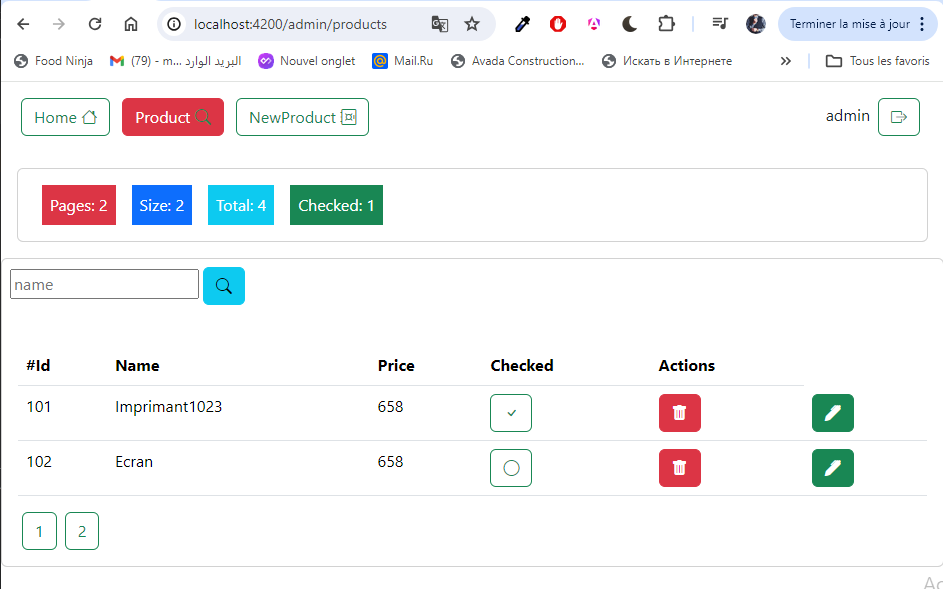

<h3>Création d'une application web Angular qui permet de gérer des produits avec un backend basé 
sur Json-server<h3>

<strong>Authentification:</strong>
   

  
  <strong>Admin Interface:</strong>

  
  <strong>Add New Product:</strong>

  
  <strong>Not Authorize User: </strong>

 

 
<strong>User Interface </strong>
   

 

